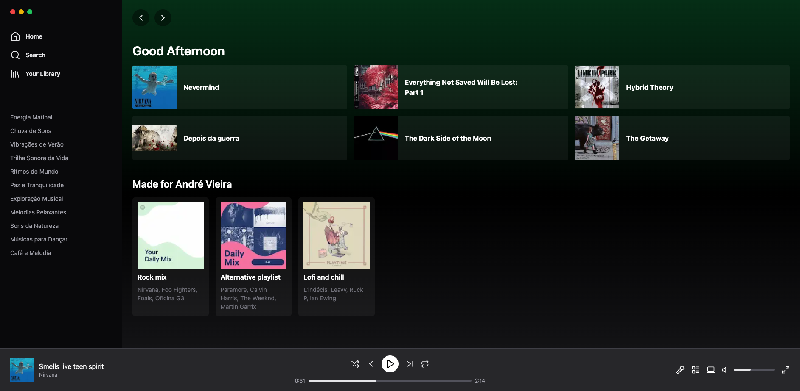

# Spotify Template App

This is a Spotify template app created to learn and practice Next.js and Tailwind CSS technologies.

## Table of Contents

- [Introduction](#introduction)
- [Features](#features)
- [Technologies Used](#technologies-used)
- [Screenshots](#screenshots)
- [License](#license)

## Introduction

The Spotify Template App is a frontend project designed to mimic the Spotify web application interface. It was built using Next.js and Tailwind CSS to understand and practice these technologies.

## Features

- Spotify-like UI/UX
- Styled components using Tailwind CSS

## Technologies Used

- [Next.js](https://nextjs.org/)
- [Tailwind CSS](https://tailwindcss.com/)
- [React](https://reactjs.org/)
- [TypeScript](https://www.typescriptlang.org/)

## Screenshots

## License

Distributed under the MIT License. See `LICENSE` for more information.
